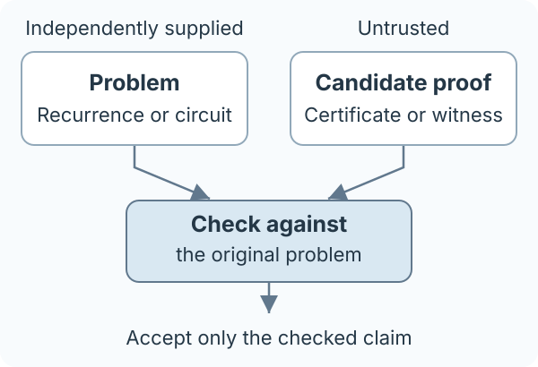

# Algebraic Loop Certificates

### From algebraic loop structure to independently checkable certificates

This repository studies two ways to turn a finite-state loop into a reusable proof:

| Question | Checked result |
|---|---|
| When does a recurrence visit a specified state? | All target-hit times, through the production [`alc/`](alc/) checker |
| Can a reseeding binary register reach a bad output? | A witness checked against the original circuit, through the research [safety exporter](research/odd_order_witness_v1/README.md) |

Both separate finding a proof from checking it. The problem is supplied
independently of the candidate, so a proof cannot substitute an easier problem.

<p align="center">
  
</p>

The two routes have different contracts: a target-hit summary does not establish
arbitrary program safety, and the safety exporter does not use the complete
orbit engine.

## Start with the teaching path

The single background anchor is **Zohar Manna and Amir Pnueli,
_Temporal Verification of Reactive Systems: Safety_ (1995)**. Its transition-system,
inductive-invariant and history-variable perspective leads into the safety
construction here. The repository supplies the additional algebra and
executable-certificate bridge.

Read the repository in three passes:

| Pass | Route and purpose |
|---|---|
| **Orient** | This page, then the **[book route](docs/LEARNING_PATH.md)**: questions, prerequisites and selected sections |
| **Understand** | The **[worked tutorial](docs/TUTORIAL.md)**: a three-bit example, seed periods and the history invariant |
| **Check** | The **[reproduction lab](docs/REPRODUCING.md)**, [exact theory](research/odd_order_witness_v1/THEORY.md) and [interface contract](research/odd_order_witness_v1/CONTRACT.md): code, proof and retained evidence |

The [contribution assessment](research/CONTRIBUTION_ASSESSMENT_18.md) states
what the completed study supports and where its claims stop.

## Try a complete target-hit example

A loop may run for an enormous number of iterations while its visits to one target have a short description:

```math
\{t\geq0:x_t=b\}=\{t_0+jr:j\geq0\}.
```

The production checker does not enumerate the orbit, search for a discrete logarithm, or factor an integer: it checks supplied witnesses using exact arithmetic. A verified summary supports time-window and schedule calculations without replaying the loop.

Requires Python 3.10 or later. The commands run directly from a checkout with no third-party runtime dependencies.

```sh
python -m alc verify \
  --problem examples/fibonacci_f7/problem.json \
  --certificate examples/fibonacci_f7/certificate.json

python -m alc query \
  --problem examples/fibonacci_f7/problem.json \
  --certificate examples/fibonacci_f7/certificate.json \
  --from 1000000000000000000000000000000 \
  --through 1000000000000000000000000000100
```

The recurrence is `(x,y) -> (x+y,x) mod 7`, starting at `(1,0)`, with target `(4,5)`. The checker establishes the **complete** hit set `11 + 16j`, not just one observed hit. The second command reports six hits in the inclusive interval: the first is `10^30 + 11` and the last is `10^30 + 91`.

Run `python verify.py` on Linux for the full offline verification. The [reproduction guide](docs/REPRODUCING.md) explains candidate generation and the research witness checks. The production producer uses bounded classical enumeration and trial division; exhausting its budget is **inconclusive**, never a proof of unreachability.

## What the completed study establishes

The [54-trial comparison](research/BOUNDED_COMPARISON_GATE_17.md) meets its
added-coverage criterion at width 8:

| Fixed width-8 route | Three repetitions |
|---|---|
| Algebraic witness exporter | Three accepted witnesses; 4.397–4.713 seconds |
| Pinned rIC3 configuration | Three deadline outcomes |

All 180 completed study CNF proofs replay independently; native translations
remain trusted. This result concerns a fixed, structurally hinted source family
and a fixed native configuration. Deadline observations do not supply a speedup
ratio.

The [completed assessment](research/CONTRIBUTION_ASSESSMENT_18.md) retains this as a reproducible integration case study. It does not clear a distinct standalone contribution or a benefit for the complete orbit engine. The study is frozen, with no further experiment scheduled. Manuscript preparation is on hold.

## Reference map

| Document | What it establishes |
|---|---|
| [Mathematical specification and proof](docs/SPECIFICATION.md) | Exact domain, complete positive-hit theorem, and the role of primality proofs |
| [Certificate and command-line interface](docs/FORMAT.md) | Trusted input, untrusted certificate, validation rules, exit codes, and limits |
| [Research assessment](docs/RESEARCH.md) | Prior work, supported claims, and the bounded stopping decision |
| [Research modules and latest decisions](research/README.md) | Experimental certificates, witness integration, prior-work decisions, and the bounded completion study |
| [Verification record](evidence/README.md) | Finite families actually checked and what was not tested |
| [Origin and import status](provenance/ORIGIN.md) | Relationship to the quantum project and the unavailable earlier ZIP |
| [Current work order](work_orders/CURRENT.md) | Teaching documentation, completed assessment, and conditions for reopening scientific work |

## Supported now

The production `alc/` implementation covers invertible linear and affine maps `x -> A x + c` over **prime fields** `F_p`, with a supplied initial state and a **full-state target**. It checks the modulus by a Lucas-Pratt proof, matrix invertibility by an inverse witness, and the least point period using a complete proved-prime factorization. The certificate is bound to a separately supplied canonical problem document.

Extension fields, composite-modulus arithmetic, machine-word overflow, singular maps with transient tails, arbitrary guards, and general negative certificates are **not implemented**. The mathematics can be discussed more broadly than this implementation; unsupported encodings are rejected, not silently reinterpreted.

That boundary applies to the production `alc/` API. Separate [research modules](research/README.md) implement complete point-orbit certificates and reusable source recognizers, including scoped modular extensions. Their contracts and evidence do not silently broaden the production API.

A positive certificate says nothing about whether the recurrence was faithfully extracted from a larger program. That extraction and the trusted problem specification are outside the current checker.

## Repository structure

`alc/producer.py` creates candidate proofs. `alc/checker.py` is independent of the producer and performs no discovery. `alc/consumer.py` uses accepted summaries. `tests/` includes independently stepped orbits and deliberately false proofs. `examples/` contains linear, affine, and fixed-point cases. GitHub Actions runs the same local verifier.

The finite-field orbit reduction, inductive safety proofs and history-variable methods precede this project. The [source-by-source assessment](docs/RESEARCH.md) distinguishes these foundations from the implementation and measured integration result.

## Relationship to the original project

This is an independent classical spinoff of [Quantum-Assisted Algorithm Discovery](https://github.com/GoGoKo699/Quantum-Assisted-Algorithm-Discovery). A quantum producer could supply certificates later, but neither the checker nor the consumer requires quantum hardware. The original project and its research branches are unchanged.

[MIT license](LICENSE), Copyright (c) 2026 Ruge Lin. The license supplied when this repository was created is preserved byte-for-byte.
